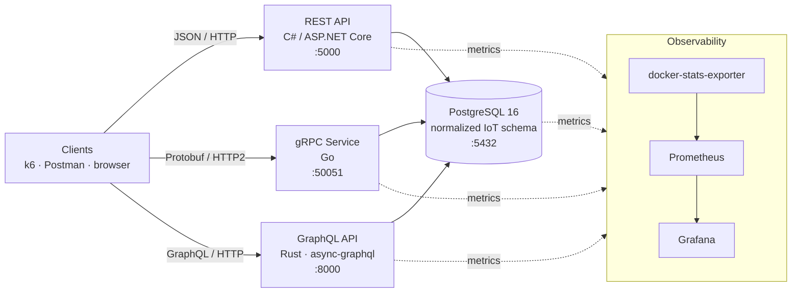

# Project one - Microservices Communication

This project demonstrates implementation and comparison of different microservice communication approaches using modern backend technologies and observability tools.

The goal of the project is to explore how different communication protocols behave in distributed systems environments, as well as to analyze their performance, scalability, developer experience, and monitoring capabilities.

---

## Database bootstrap

The project starts with a single PostgreSQL container defined in `docker-compose.yml`.

```bash
docker compose up -d postgres
```

Schema setup is migration-based. After starting PostgreSQL, run migrations and then load the UCI Air Quality dataset.

```bash
# apply migrations and import CSV
cd project-one
bash db/run_migrations.sh
bash db/import_via_copy.sh path/to/AirQualityUCI.csv
```

---

# Technologies

| Communication Type | Technology Stack |
|---|---|
| REST API | C# / ASP.NET Core |
| gRPC Service | Go |
| GraphQL API | Rust |
| Monitoring | Prometheus |
| Visualization | Grafana |
| Containerization | Docker & Docker Compose |

---

# Project Goals

- Implement equivalent microservices using different communication technologies
- Compare REST, gRPC, and GraphQL approaches
- Analyze request performance and latency
- Monitor services using Prometheus
- Visualize metrics and system health using Grafana
- Explore distributed systems architecture concepts

---

# Architecture Overview

Three independent microservices expose the **same five operations** over one
shared PostgreSQL database, each using a different communication protocol and
technology stack. A metrics pipeline observes every container during load tests.



Each service exposes equivalent business functionality (list sensor types, list
readings, get by id, create reading, aggregate) while differing only at the
transport/serialization edge. Detailed diagrams — ER model, per-protocol data
flow, and scenario sequences — are in [`docs/architecture.md`](docs/architecture.md).

---

# Project Structure

```text
project-one/
│
├── rest-service-csharp/
│   ├── src/
│   ├── Dockerfile
│   └── README.md
│
├── grpc-service-go/
│   ├── cmd/
│   ├── proto/
│   ├── Dockerfile
│   └── README.md
│
├── graphql-service-rust/
│   ├── src/
│   ├── Cargo.toml
│   ├── Dockerfile
│   └── README.md
│
├── monitoring/
│   ├── prometheus/
│   │   └── prometheus.yml
│   │
│   └── grafana/
│       └── dashboards/
│
├── docs/
│   ├── architecture.md
│   ├── benchmarks.md
│   └── protocol-comparison.md
│
└── docker-compose.yml
```

---

# Communication Technologies

## REST

Implemented using ASP.NET Core in C#.
Current implementation uses controller-based endpoints with EF Core over PostgreSQL.

### Characteristics

- HTTP-based communication
- Human-readable JSON payloads
- Widely adopted and easy to integrate
- Suitable for standard CRUD operations

---

## gRPC

Implemented using Go.

### Characteristics

- High-performance binary protocol
- Uses Protocol Buffers
- Supports streaming
- Strongly typed contracts
- Efficient for inter-service communication

---

## GraphQL

Implemented using Rust.

### Characteristics

- Flexible querying
- Clients request only required data
- Single endpoint architecture
- Reduces over-fetching and under-fetching

---

# Monitoring & Observability

## Prometheus

Prometheus will be used for:

- Request counting
- Response time metrics
- Error tracking
- Service health monitoring
- Resource usage monitoring

Example metrics:

- HTTP request duration
- Requests per second
- Error rates
- Memory usage
- CPU usage

---

## Grafana

Grafana will be used for visualization and dashboard creation.

Dashboards may include:

- Service latency comparison
- Request throughput
- Error distribution
- Resource consumption
- Real-time monitoring panels

---

# Running the Project

## Prerequisites

Required software:

- Docker
- Docker Compose
- .NET SDK
- Go
- Rust
- Git

---

# Running with Docker Compose

From the `project-one/` directory:

```bash
docker compose up --build
```

This currently starts:

- PostgreSQL database
- REST service (C# / ASP.NET Core) on port 5000
- gRPC service (Go) on port 50051
- GraphQL service (Rust) on port 8000

### REST testing quick links

- OpenAPI JSON: `http://localhost:5000/openapi/v1.json`
- Postman assets: `rest-service-csharp/postman/`

### gRPC testing

- Port: `localhost:50051`
- Proto definitions: `grpc-service-go/proto/iot/v1/readings.proto`
- Service documentation: `grpc-service-go/README.md`

### GraphQL testing

- GraphQL Endpoint: `http://localhost:8000/graphql`
- Service documentation: `graphql-service-rust/README.md`
- Schema exploration available via GraphQL playground tools

---

# Active Service Ports

| Service | Port |
|---|---|
| PostgreSQL | 5432 |
| REST API | 5000 |
| gRPC service | 50051 |
| GraphQL API | 8000 |

---

# Current runtime note

The current `docker-compose.yml` starts PostgreSQL, REST service, gRPC service, GraphQL service, cAdvisor, Prometheus, and Grafana.

## Container CPU and RAM usage

Use `docker stats` for a live terminal view:

```bash
docker stats project-one-postgres project-one-rest-service-csharp project-one-grpc-service-go project-one-graphql-service-rust
```

For historical charts:

- cAdvisor: `http://localhost:8085`
- Prometheus: `http://localhost:9090`
- Grafana: `http://localhost:3000` (admin / admin)

In this Docker Desktop environment, cAdvisor exposes the Docker runtime cgroup, so Grafana shows the runtime's CPU/RAM trend while `docker stats` gives the exact per-container view.

## Validation checklist

1. `docker compose ps` shows PostgreSQL, REST, gRPC, GraphQL, cAdvisor, Prometheus, and Grafana as running.
2. `docker stats --no-stream ...` shows CPU and memory for each application container.
3. Prometheus target health is `up=1` for `cadvisor:8080` and `prometheus:9090`.
4. Prometheus queries return data:
   - `container_memory_working_set_bytes{id="/restricted"}`
   - `rate(container_cpu_usage_seconds_total{id="/restricted"}[5m])`
5. Grafana `http://localhost:3000` contains the `Docker Runtime Resources` dashboard and the time range is set to the last 15 minutes.

If Grafana still looks empty, open **Explore** and run the Prometheus queries above directly; if they return data there, the dashboard is the only layer that needs adjustment.

---

# Benchmarking & Analysis

The project may include benchmarking and protocol comparison based on:

- Response latency
- Throughput
- Payload size
- Serialization overhead
- Scalability
- Developer experience
- Ease of integration

Results and analysis can be found inside:

```text
docs/benchmarks.md
```

## k6 load tests

The load-test scripts live in `load-tests/k6/`:

- `01-ingestion.js`
- `02-selective-monitoring.js`
- `03-historical-aggregation.js`

They target the live compose services by default:

- REST: `http://host.docker.internal:5000`
- GraphQL: `http://host.docker.internal:8000/graphql`
- gRPC: `host.docker.internal:50051`

Each script sweeps the assignment's **10 / 100 / 500 virtual users** via the `VUS`
env var (`constant-vus` executor). Key env vars:

- `VUS` — virtual users (10, 100, 500). `DURATION` — hold time (e.g. `12s`).
- `PROTOCOL` — `rest` | `grpc` | `graphql` | `all` (default `all`, runs the three
  concurrently; set one value to isolate a protocol for clean metrics).
- `REST_BASE_URL`, `GRAPHQL_URL`, `GRPC_ADDR`, `GRPC_PROTO_DIR` — endpoint overrides.

Example (selective monitoring, gRPC only, 100 VUs):

```bash
docker run --rm -v "$(pwd):/work" -w /work \
  -e VUS=100 -e DURATION=12s -e PROTOCOL=grpc \
  -e GRPC_PROTO_DIR=/work/grpc-service-go/proto \
  grafana/k6 run --summary-export=/work/load-tests/results/out.json \
  load-tests/k6/02-selective-monitoring.js
```

Measured results (latency, p95, RPS, CPU/RAM, payload sizes) are in
[`docs/benchmarks.md`](docs/benchmarks.md).

---

# Future Improvements

Possible future extensions:

- Kubernetes deployment
- API Gateway integration
- Authentication & authorization
- Distributed tracing
- CI/CD pipelines
- Service discovery
- Load balancing

---

# Author

Aleksandar Mitic  
Faculty of Electronic Engineering, University of Nis
