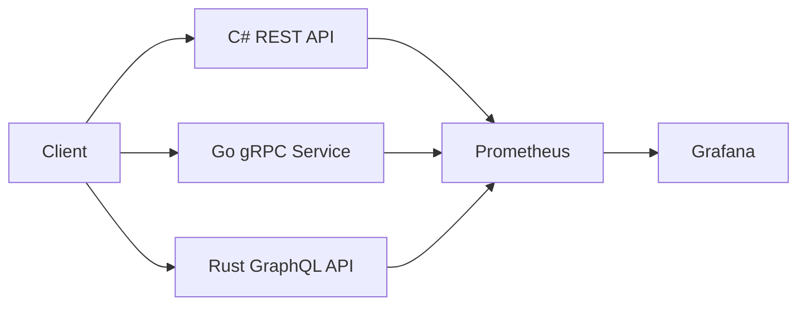

# Documentation & Architecture Design

This project uses a structured documentation approach combining:

- Mermaid diagrams (source of truth for architecture)
- Excalidraw diagrams (human-friendly visual design layer)
- Markdown documentation for design decisions and benchmarks

---

## Architecture Diagrams Workflow

We follow a **diagram-as-code → visual refinement** approach:

### Step 1: Mermaid (source of truth)

All architecture starts as a Mermaid diagram:



This ensures:
- Version control compatibility
- Easy updates
- Reproducible architecture

---

The complete, rendered set of diagrams (system architecture, ER model,
per-protocol data flow, and the three scenario sequence diagrams) lives in
[`architecture.md`](architecture.md) — that file is the source of truth.

### Step 2 (optional): Excalidraw (visual refinement)

The Mermaid diagrams can optionally be recreated in Excalidraw for
presentation-ready visuals (improved layout, icons, grouping). If produced, store
them alongside the docs, e.g. `docs/excalidraw/architecture.excalidraw` /
`.png`. This step is not required — the Mermaid source renders directly on GitHub.

---

## Design Principles Used

The system architecture follows modern distributed systems practices:

### 1. Service Isolation
- Each service is independently deployable
- No shared runtime dependencies

### 2. Polyglot Microservices
- Each service uses a different language/runtime:
  - C# (REST)
  - Go (gRPC)
  - Rust (GraphQL)

### 3. Observability First
- Metrics exposed by all services
- Centralized monitoring via Prometheus
- Visualization via Grafana dashboards

### 4. Contract-Based Communication
- REST → HTTP contracts
- gRPC → Proto definitions
- GraphQL → Schema-based queries

### 5. Infrastructure as Code
- Docker Compose defines full system
- Reproducible environment setup

---

## Benchmarking & Evaluation

All services are compared using:

- Latency (avg, p95, p99)
- Throughput (req/sec)
- Payload size
- Serialization overhead
- CPU & memory usage

Results are documented in:

```
docs/benchmarks.md
```

---

## Protocol Comparison

A structured comparison is provided in:

```
docs/protocol-comparison.md
```

Covering:
- REST vs gRPC vs GraphQL
- Use-case suitability
- Performance tradeoffs
- Developer experience