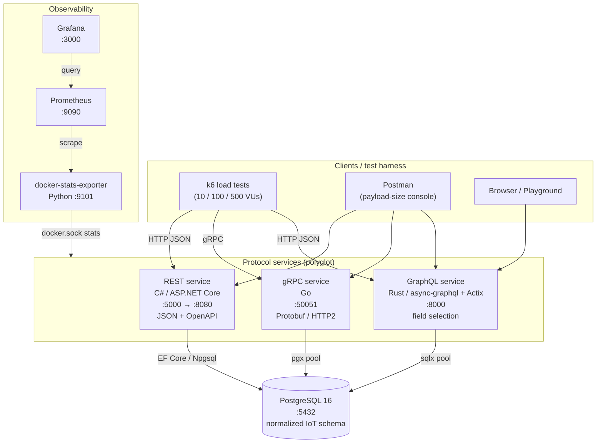
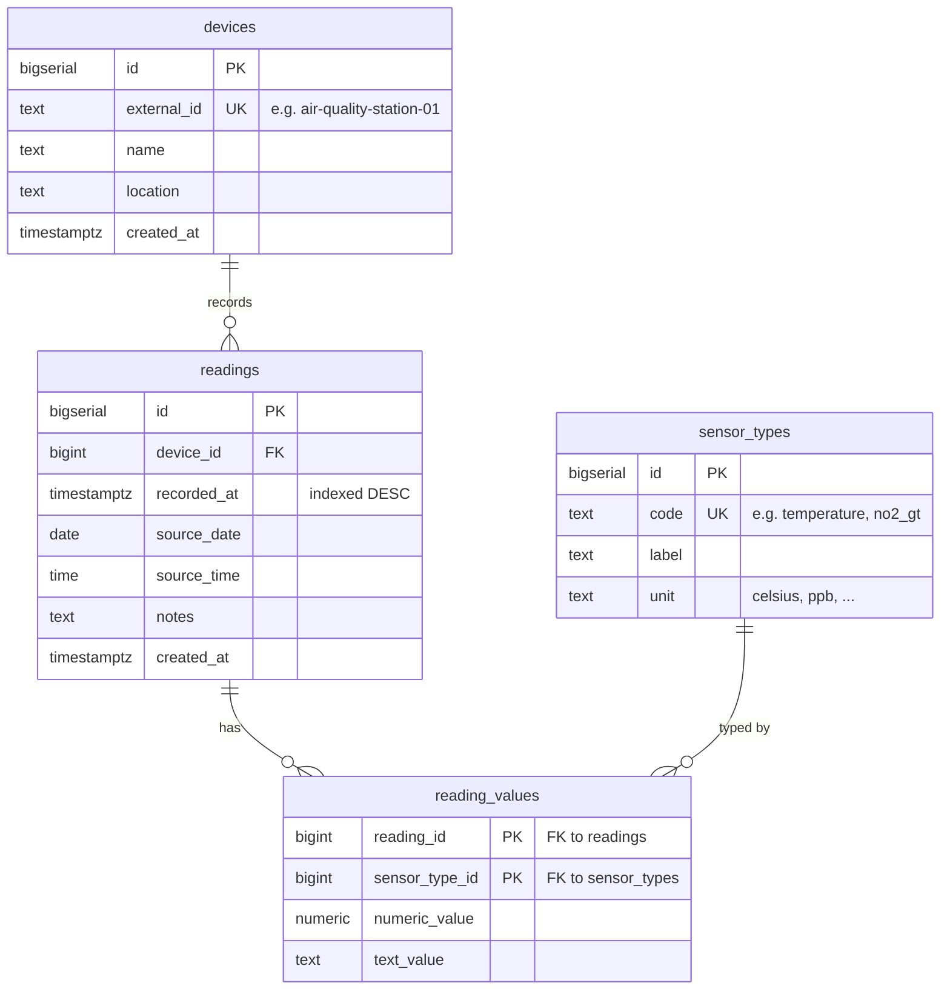
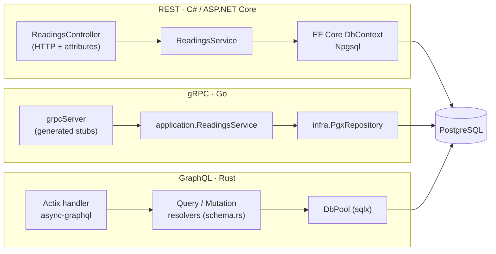
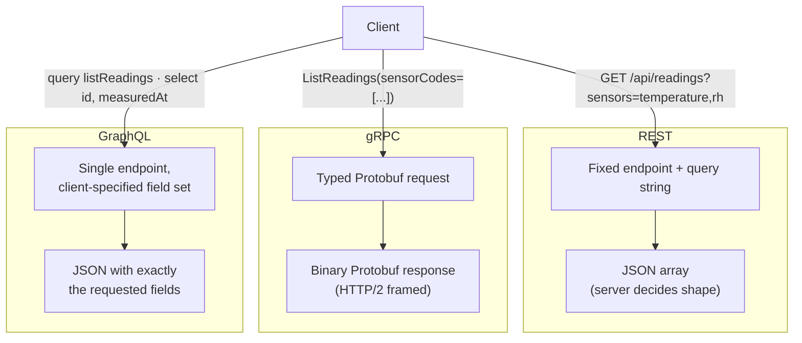
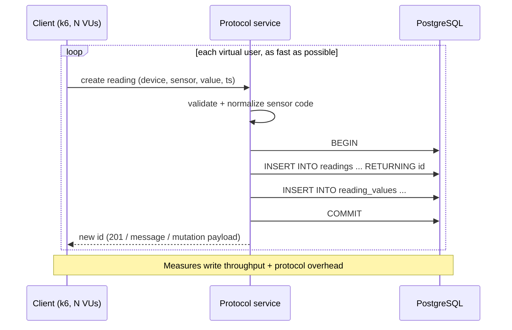
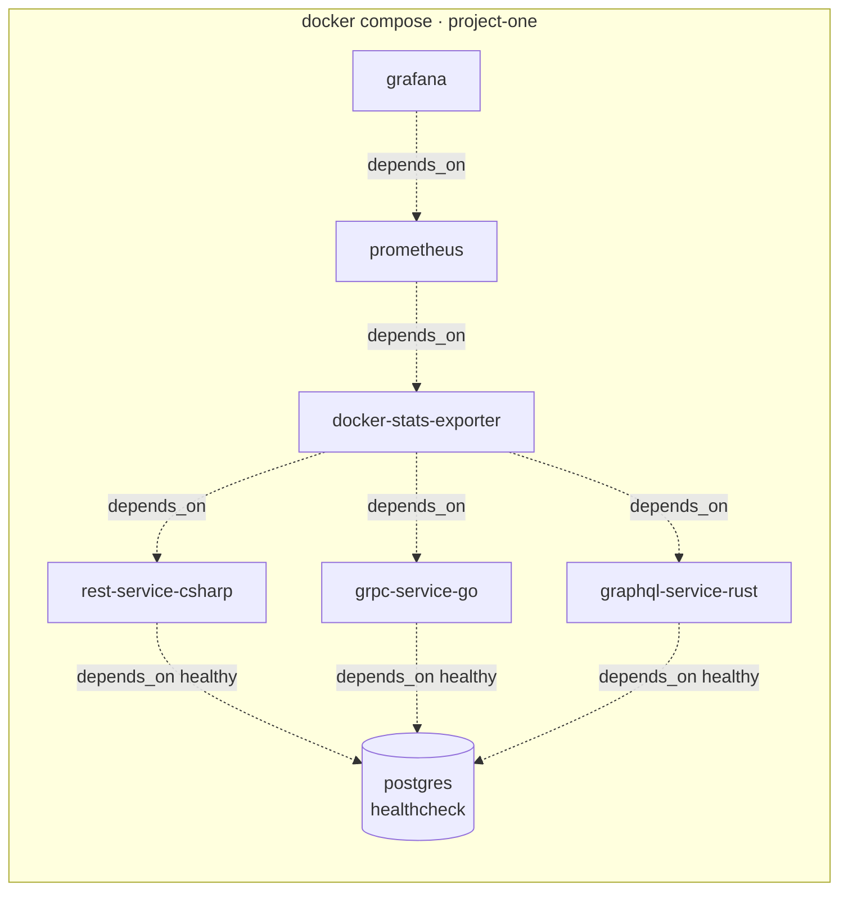

# System Architecture

Comparative study of three synchronous communication paradigms — **REST**, **gRPC**
and **GraphQL** — over one shared PostgreSQL database, in a polyglot, fully
containerized IoT microservice system. The dataset is the
[UCI Air Quality](https://archive.ics.uci.edu/dataset/360/air+quality) time series
(9,357 hourly readings, 13 sensors, 2004-03-10 → 2005-04-04).

All diagrams below are Mermaid (diagram-as-code, the source of truth). GitHub,
VS Code (Markdown Preview Mermaid Support) and most Markdown viewers render them
natively.

---

## 1. System / container architecture

How the whole system fits together: three protocol services share one database,
and a metrics pipeline observes every container.



**Design principles**

- **Service isolation** — each service is an independently deployable container.
- **Polyglot** — REST in C#, gRPC in Go, GraphQL in Rust (satisfies the "≥ 2
  technologies" requirement three times over).
- **Contract-based** — REST → OpenAPI, gRPC → `.proto`, GraphQL → schema.
- **Shared source of truth** — all three read/write the *same* normalized tables,
  so protocol behavior is compared on identical data.
- **Observability-first** — CPU/RAM of every container is scraped during load tests.

---

## 2. Database schema (ER diagram)

The schema is normalized: one `readings` row per timestamped observation, and one
`reading_values` row per (reading, sensor) measurement. It is optimized for IoT
access patterns via a composite `(device_id, recorded_at DESC)` index and a
`recorded_at DESC` index.



**Indexes** (from `db/0001_schema_and_staging.up.sql`)

| Index | Columns | Serves |
|---|---|---|
| `idx_readings_device_recorded_at` | `(device_id, recorded_at DESC)` | device-scoped time queries (Scenario B/C) |
| `idx_readings_recorded_at` | `(recorded_at DESC)` | global time-range scans |
| `idx_reading_values_sensor_type` | `(sensor_type_id)` | per-sensor aggregation (Scenario C) |

Ingestion path: CSV → `staging_airquality` (server-side `COPY`) →
`0002_transform.up.sql` unpivots the 13 sensor columns into `reading_values`.

---

## 3. Internal layering (per service)

Each service uses a clean, layered architecture so the only real difference is the
transport/serialization edge — the persistence logic is equivalent.



All three expose the same five operations:

| Operation | REST | gRPC | GraphQL |
|---|---|---|---|
| List sensor types | `GET /api/sensor-types` | `ListSensorTypes` | `listSensorTypes` |
| List readings | `GET /api/readings` | `ListReadings` | `listReadings` |
| Get reading by id | `GET /api/readings/{id}` | `GetReading` | `getReading` |
| Create reading | `POST /api/readings` | `CreateReading` | `createReading` (mutation) |
| Aggregate | `GET /api/readings/aggregate` | `AggregateReadings` | `aggregateReadings` |

---

## 4. Request data flow by protocol

The same logical request ("give me readings") is shaped differently on the wire.



Key difference for **Scenario B (selective monitoring)**: REST needs a purpose-built
`sensors=` parameter, gRPC needs `sensor_codes` in the message, but GraphQL lets the
client pick fields *without any server change* — this is the over-fetch-avoidance the
project is built to demonstrate.

---

## 5. Scenario sequence diagrams

### Scenario A — High-Frequency Ingestion (`POST` / `CreateReading` / `createReading`)



### Scenario B — Selective Monitoring (client wants 2 of many sensors)

```mermaid
sequenceDiagram
    participant C as Client (poor connection)
    participant S as Protocol service
    participant DB as PostgreSQL
    C->>S: list readings, only [temperature, relative_humidity]
    S->>DB: SELECT ... JOIN reading_values JOIN sensor_types<br/>WHERE code = ANY($sensors)
    DB-->>S: rows
    S-->>C: minimal payload (only requested sensors/fields)
    Note over C,S: GraphQL trims fields client-side;<br/>REST/gRPC trim via explicit filter params
```

### Scenario C — Heavy Querying (historical aggregation)

```mermaid
sequenceDiagram
    participant C as Client
    participant S as Protocol service
    participant DB as PostgreSQL
    C->>S: aggregate(sensor, bucketMinutes, from, to)
    S->>DB: SELECT time_bucket, AVG/MIN/MAX/COUNT<br/>GROUP BY bucket ORDER BY bucket
    DB-->>S: aggregate points (server-side reduction)
    S-->>C: compact aggregate series
    Note over DB: Uses recorded_at + sensor_type indexes;<br/>heavy scan over 2004-2005 range
```

---

## 6. Deployment topology (Docker Compose)



| Container | Image / build | Host port | Purpose |
|---|---|---|---|
| `postgres` | `postgres:16-alpine` | 5432 | shared datastore |
| `rest-service-csharp` | build | 5000 | REST / JSON / OpenAPI |
| `grpc-service-go` | build | 50051 | gRPC / Protobuf |
| `graphql-service-rust` | build | 8000 | GraphQL / field selection |
| `docker-stats-exporter` | build | 9101 | per-container CPU/RAM → Prometheus |
| `prometheus` | `prom/prometheus` | 9090 | metrics storage |
| `grafana` | `grafana/grafana` | 3000 | dashboards |

---

## Related documents

- [`benchmarks.md`](benchmarks.md) — k6 latency/RPS + docker-stats CPU/RAM results.
- [`protocol-comparison.md`](protocol-comparison.md) — REST vs gRPC vs GraphQL analysis
  and payload-size (JSON vs Protobuf) measurements.
- [`../README.md`](../README.md) — run instructions and quick links.
