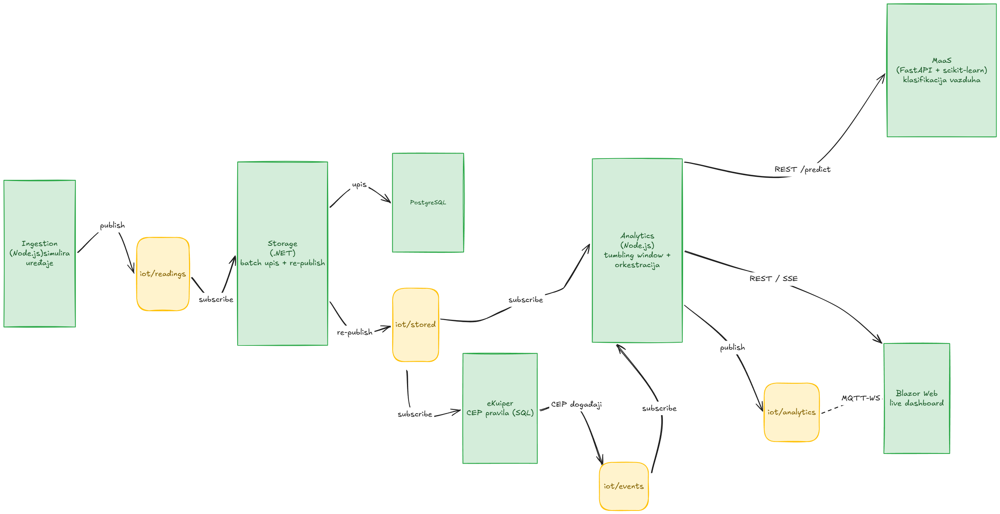

# Projekat 3 — IoT analitika sa eKuiper (CEP) i MaaS (ML)

Nadogradnja **Analytics** mikroservisa iz [Projekta 2](../project-two) tako da za analizu
podataka koristi:

- **eKuiper** — streaming / CEP (Complex Event Processing) servis preko MQTT brokera, i
- **MaaS** — Model-as-a-Service mikroservis (Python + FastAPI + scikit-learn) preko REST endpointa.

Ceo sistem je kontejnerizovan (Docker Compose) i koristi isti IoT dataset (Air Quality UCI) i
model podataka kao Projekti 1 i 2.

> **Status:** Faze 0–6 završene — ceo stack (Ingestion, Storage, Analytics, MaaS, eKuiper i
> **Blazor web dashboard**) je implementiran, podignut kroz Docker Compose i **verifikovan
> end-to-end** pod realnim saobraćajem (svih 9 servisa zajedno, kontinuirana simulacija >1 min).
> Verifikacija je otkrila i ispravila dva runtime bug-a (Storage crash-loop i MaaS 404) — vidi
> [PROBLEMS.md](PROBLEMS.md). Demo skripta i screenshotovi: [docs/DEMO.docx](docs/DEMO.docx).
> Ostaje Faza 7 (polish, GitHub push). Detaljan plan: [PLAN.md](PLAN.md) · dnevnik implementacije:
> [docs/IMPLEMENTACIJA.md](docs/IMPLEMENTACIJA.md) · pronađeni bugovi: [PROBLEMS.md](PROBLEMS.md).

## Arhitektura



```
Ingestion ─iot/readings─► Storage (.NET) ─► PostgreSQL
                             └─ re-publish ─► iot/stored ─┬─► eKuiper (CEP) ─► iot/events ─┐
                                                          └─► Analytics ◄──────────────────┘
                                                                 ├─ tumbling window (alarm)
                                                                 ├─ MaaS REST /predict (klasa vazduha)
                                                                 └─ publish ─► iot/analytics ─► Blazor web dashboard

MaaS (FastAPI + scikit-learn):  /predict  /model/info
```

MQTT topici:

| Topic | Producer | Consumer | Sadržaj |
|---|---|---|---|
| `iot/readings` | Ingestion | Storage | sirova očitavanja `{deviceId, timestamp, readings{13 senzora}}` |
| `iot/stored` | Storage | Analytics, eKuiper | perzistirano očitavanje + `storedAt` |
| `iot/events` | eKuiper | Analytics | CEP događaji `{type, severity, rule, ...}` |
| `iot/analytics` | Analytics | (web dashboard, Faza 5) | objedinjeni rezime `ANALYTICS_SUMMARY` (prozor + ML klasa) |

## Mikroservisi

| Servis | Tehnologija | Uloga | Status |
|---|---|---|---|
| Ingestion | Node.js | Simulira uređaje i publikuje očitavanja na `iot/readings` | ✅ |
| Storage | .NET | Batch upis u PostgreSQL + re-publish na `iot/stored` | ✅ |
| Analytics | Node.js | Window + eKuiper događaji + MaaS predikcije → `iot/analytics` | ✅ |
| eKuiper | lfedge/ekuiper | CEP pravila nad `iot/stored` → događaji na `iot/events` | ✅ |
| MaaS | Python / FastAPI | Klasifikacija kvaliteta vazduha (scikit-learn), REST `/predict` | ✅ |
| Web | Blazor (.NET) | Live dashboard (MQTT + SignalR): očitavanja, CEP, ML klasa, alarmi | ✅ |

---

## Pokretanje

### 1. Preduslovi

- Docker + Docker Compose.
- (Opciono) `curl` za pozivanje REST endpointa. `mosquitto_sub` nije potreban lokalno — koristi se
  kroz `docker exec` u mosquitto kontejneru.

### 2. Podizanje stack-a

```bash
cp .env.example .env             # lokalna konfiguracija (.env nije u gitu)
docker compose up -d --build
```

Diže se stack servisa: `postgres`, `mosquitto`, `ingestion`, `storage`, `analytics`, `ekuiper`,
`ekuiper-init` (jednokratni provisioning eKuiper pravila, izađe posle registracije), `maas` i
`web`.

- **Postgres** se pri prvom podizanju automatski inicijalizuje šemom + seed-om
  (`db/0001_schema_and_staging.up.sql` je mount-ovan u `initdb.d`).
- **eKuiper** dobija stream `iotStream` i 3 pravila automatski (init kontejner).
- **MaaS** učitava komitovani model (`services/maas/model/model.joblib`) — nema treninga pri podizanju.
- **Web dashboard** je dostupan na <http://localhost:8090> (Blazor Server + live MQTT).

Za učitavanje istorijskog dataseta u bazu (opciono, nije potrebno za live tok):

```bash
bash db/import_via_copy.sh
```

### 3. Pokretanje simulacije

```bash
# forceAlert=true -> temperatura 51–60 °C, garantovano okida HIGH_TEMP / WINDOW_HIGH_TEMP u eKuiper-u
curl -X POST http://localhost:3000/simulate/start \
  -H 'Content-Type: application/json' \
  -d '{ "deviceCount": 10, "intervalMs": 1000, "forceAlert": true }'

# zaustavljanje
curl -X POST http://localhost:3000/simulate/stop
```

### 4. Verifikacija (end-to-end)

```bash
# (a) Storage upisuje i re-publikuje
curl -s localhost:8080/health          # metrics.republishedMessages raste

# (b) Perzistirana očitavanja na iot/stored (imaju storedAt)
docker exec project-three-mosquitto mosquitto_sub -t iot/stored -C 2

# (c) eKuiper CEP događaji na iot/events (uz forceAlert simulaciju)
docker exec project-three-mosquitto mosquitto_sub -t iot/events -C 2
curl -s localhost:9081/rules           # status registrovanih pravila

# (d) Analytics: window + eKuiper događaji + MaaS predikcije + objedinjeni alarmi
curl -s localhost:3001/window/stats
curl -s localhost:3001/events        # CEP događaji koje je Analytics primio sa iot/events
curl -s localhost:3001/predictions   # MaaS predikcije po prozoru
curl -s localhost:3001/alerts        # objedinjeni alarmi (prag + CEP + ML)
docker exec project-three-mosquitto mosquitto_sub -t iot/analytics -C 1   # objedinjeni rezime po prozoru

# (e) MaaS klasifikacija
curl -s localhost:8000/model/info
curl -s -X POST localhost:8000/predict -H 'Content-Type: application/json' -d '{
  "readings": { "pt08_s1_co":1050, "pt08_s2_nmhc":900, "pt08_s3_nox":800,
    "pt08_s4_no2":1500, "pt08_s5_o3":1100, "temperature":21.5,
    "relative_humidity":48.2, "absolute_humidity":1.1 }
}'
```

### Portovi i endpointi

| Servis | URL | Rute |
|---|---|---|
| ingestion | http://localhost:3000 | `/health`, `/config`, `POST /simulate/start`, `POST /simulate/stop` |
| analytics | http://localhost:3001 | `/health`, `/config`, `/window/stats`, `/events`, `/predictions`, `/alerts` |
| storage | http://localhost:8080 | `/`, `/health`, `/config` |
| maas | http://localhost:8000 | `/health`, `/model/info`, `POST /predict`, `POST /predict/batch` |
| eKuiper | http://localhost:9081 | `/streams`, `/rules` (REST API) |
| **web** | **http://localhost:8090** | **Blazor dashboard (otvoriti u browseru)** |
| mosquitto | tcp://localhost:1883, ws://localhost:9001 | MQTT / MQTT-over-WebSockets |

---

## Konfiguracija

Sve knob-ove drži `.env` (vidi `.env.example`). Projekat 3 radi u `BROKER_MODE=mqtt`
(Kafka kod je nasleđen iz P2 ali se ne pokreće). Ključni parametri:
`MQTT_TOPIC`, `MQTT_STORED_TOPIC`, `MQTT_EVENTS_TOPIC`, `STORAGE_REPUBLISH`, `MAAS_URL`,
`WINDOW_SECONDS`, `ALERT_THRESHOLD`.

## Retrening MaaS modela

Model je komitovan pa se kontejner diže bez treninga. Za retrening vidi
[services/maas/README.md](services/maas/README.md).
